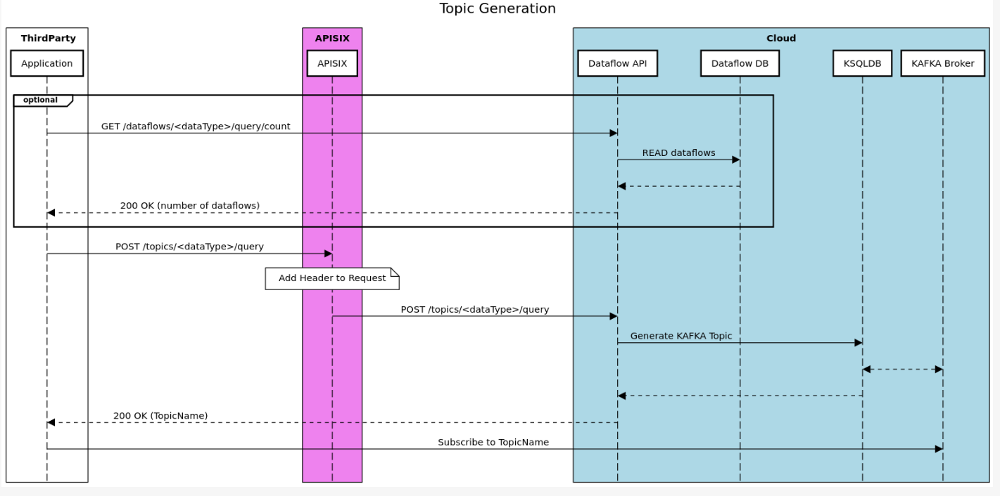

# Dataflow APIs

This project contains all the components needed to implement a Flask webserver providing the Dataflow APIs to a third party application.

*NOTE*: This branch contains the Keycloak-based topic authorization feature. 

## Interactions

This modules interacts with:
- the Cloud Dataflow DB, to retrieve information about the active dataflows;
- the KSQLDB Server, to generate user specific topics;
- APISIX, to retrieve from a specific http header information about the user performing a request.

## API Description

The yaml description of the APIs is provided in the [api](https://github.com/5gmeta/dataflow_cloud/tree/main/api) folder.    

### Dataflow Catalogue

The endpoints in this section interact with the Cloud Dataflow DB to provide to the user information about the available dataflows.    
The provided endpoints are:
- **GET /dataflows/{dataflowId}**, that returns the metadata of a specific dataflow.
- **GET /dataflows/{dataType}/query**, that returns the dataflowId of all the dataflows of a specific dataType; different query parameters are available in order to filter the dataflows.
- **GET /dataflows/{dataType}/query/count**, that returns the number of active dataflows with a specific dataType; different query parameters are available in order to filter the dataflows.
- **GET /datatypes/{dataType}/properties**, that return a JSON that, for each field of the dataflows metadata, shows the possible value that can be used as a filter.
- **GET /datatypes/{quadkey}**, returns the list of DataTypes available in a quadkey as a list of strings.

### Topics management

The endpoints in this section interact with the KSQLDB Server to allow to the third party application to manage its Kafka topics.     
To identify the third party user, APISIX should add to the request an X-userinfo header, providing an "username" field. 
The provided endpoints are:
- **POST /topics/{dataType}/query**, that generates a KAFKA topics and return the topicName to the user; different query parameters are available in order to filter the messages in the topic.
- **GET /topics**, that returns list of topicNames associated with the user.
- **GET topics/{topicName}**, that returns a JSON object containing the query that was used to generate the topic.
- **DELETE topics/{topicName}**, that deletes a specific topic.

### Topic authorization

The *authorization.py* file needs to be configured based on your Keycloak setup. Please add the following:
- Keycloak endpoint
- Realm name
- Admin client ID
- Admin client secret
- Kafka client ID
- Kafka client secret (if any)

## Authors

* Federico Princiotto ([federico.princiotto@linksfoundation.com](mailto:federico.princiotto@linksfoundation.com))

## License

Copyright : Copyright 2022 LINKS

License : EUPL 1.2 ([https://eupl.eu/1.2/en/](https://eupl.eu/1.2/en/))

The European Union Public Licence (EUPL) is a copyleft free/open source software license created on the initiative of and approved by the European Commission in 23 official languages of the European Union.

Licensed under the EUPL License, Version 1.2 (the "License"); you may not use this file except in compliance with the License. You may obtain a copy of the License at [https://eupl.eu/1.2/en/](https://eupl.eu/1.2/en/)

Unless required by applicable law or agreed to in writing, software distributed under the License is distributed on an "AS IS" BASIS, WITHOUT WARRANTIES OR CONDITIONS OF ANY KIND, either express or implied. See the License for the specific language governing permissions and limitations under the License.

